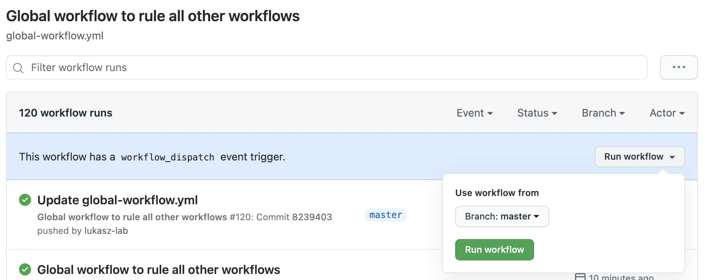
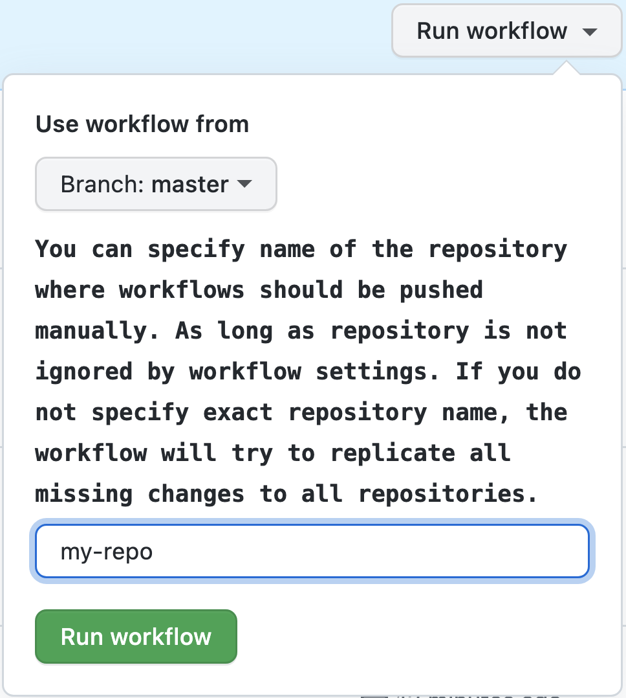
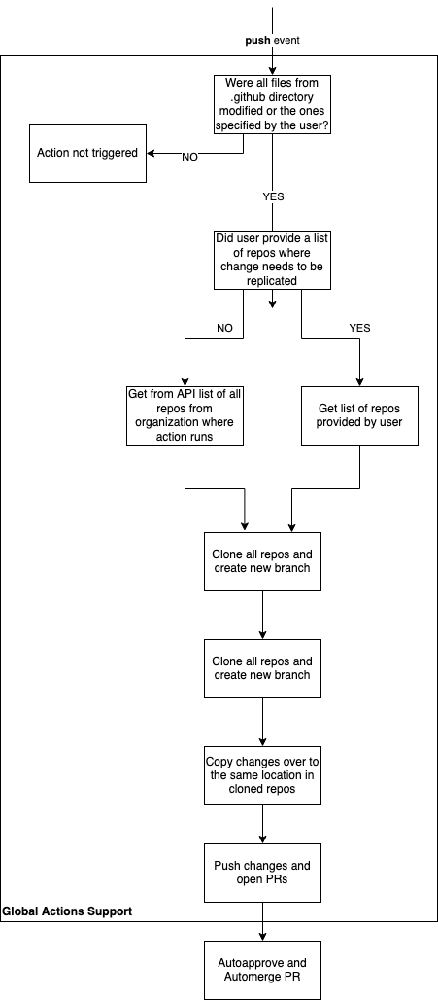

# Manage Files in Multiple Repositories

GitHub Action that enables you to keep a file in `Repository A` and copy it over, update or remove it from `Repository N`.
It is useful for use cases like:
- you have a GitHub Actions workflow files that are the same for every repo and you want to edit it only once and then see change in all the other repositories
- you have a `CODE_OF_CONDUCT.md` or `CONTRIBUTING.md` file that you want to have in the same form in all the repositories. You want to edit it in one repo and then have the change replicated in other repositories
- you have a file that has to be removed from multiple repositories

## Some breaking changes

If you used `Copy Files to Other Repositories` action before it became `Manage Files in Multiple Repositories` the only breaking change that you need to be aware of, except new features, is that now this action is also able to pick up deletions. In other words, imagine a situation where `patterns_to_include` has value `./github/workflows/another_file.yml`. The new version of action not only will pick up modifications of `another_file.yml` but also if you remove that file, this action will pick that info up and also remove the file in other repositories that have it, respecting `destination` field.

<!-- toc -->

- [Why I Created This Action?](#why-i-created-this-action)
- [Supported Event Triggers](#supported-event-triggers)
- [Action Flow](#action-flow)
- [Configuration](#configuration)
- [Examples](#examples)
  * [Minimum Workflow to Support Only Workflows Replication](#minimum-workflow-to-support-only-workflows-replication)
  * [Advanced Workflow](#advanced-workflow)
  * [Super Advanced Workflow](#super-advanced-workflow)
- [Development](#development)
- [Debug](#debug)

<!-- tocstop -->

## Why I Created This Action?

In [AsyncAPI](https://www.asyncapi.com/) we have over 50 repositories. We use GitHub Actions at scale. Many workflows are exactly the same. We keep all workflows in [.github](https://docs.github.com/en/free-pro-team@latest/github/building-a-strong-community/creating-a-default-community-health-file). This action replicates all changes to workflows to all the other repos.

Use case mentione above was first. Then more folks started using this action. So this action evolved to support any file modifications, not only workflows.

## Supported Event Triggers

This action can be triggered by:
- **push** event and only files that were changed in the commit are replicated to other repositories.
- **workflow_dispatch** event and then all files from workflow directory (except of ignored ones) are replicated to other repositories. Use case for this event is when you create new repositories in your organization that need to push standard files to it. Then you can manually trigger the action and all files will be updated in all repositories. Below screen shots shows how manual triggering works.

  

  This action also allows you to specify a single repository that action should run against. You can add the following input trigger in your workflow:

  ```yml
    workflow_dispatch:
      inputs:
        repo_name:
          description: |
            You can specify name of the repository where workflows should be pushed manually. As long as repository is not ignored by workflow settings.
            If you do not specify exact repository name, the workflow will try to replicate all missing changes to all repositories.
          required: false
  ```

  As a result you will be able to run your workflow manually by providing specific repository name. If name is not provided, action will fallback to run against all repositores. If wrong repo name is provided under `repo_name`, the action will fail.

  

## Action Flow

  

## Configuration

Name | Description | Required | Default
--|------|--|--
github_token | Token to use GitHub API. It must have "repo" and "workflow" scopes so it can push to repo and edit workflows. It cannot be the default GitHub Actions token GITHUB_TOKEN. GitHub Action token's permissions are limited to the repository that contains your workflows. Provide token of the user who has the right to push to the repos that this action is supposed to update. The same token is used for pulling repositories - important to know for those that want to use this action with private repositories. | true | -
patterns_to_ignore | Comma-separated list of file paths or directories that should be handled by this action and updated in other repositories. This option is useful if you use "patterns_to_include" or "patterns_to_remove" with large amount of files, and some of them you want to ignore. In the format `./github/workflows/another_file.yml`. Internally it is handled by standard JavaScript `includes` function. | true | -
patterns_to_remove | Comma-separated list of file paths or directories that should be handled by this action and removed from other repositories. This option do not perform any removal of files that are located in repository there this action is used. This option cannot be used at the same time with "patterns_to_include", these fields are mutually exclusive. In the format `./github/workflows`. | true | -
patterns_to_include | Comma-separated list of file paths or directories that should be handled by this action and copied or updated or removed in other repositories. Now this option is self aware not only of creation and modification but also deletion of file that match the pattern. This option cannot be used at the same time with "patterns_to_remove", these fields are mutually exclusive. In the format `.github/workflows`. Internally it is handled by standard JavaScript `includes` function. | true | -
committer_username | The username (not display name) of the committer will be used to commit changes in the workflow file in a specific repository. In the format `web-flow`. | false | `web-flow`
committer_email | The committer's email that will be used in the commit of changes in the workflow file in a specific repository. In the format `noreply@github.com`.| false | `noreply@github.com`
commit_message | It is used as a commit message when pushing changes with global workflows. It is also used as a title of the pull request that is created by this action. | false | `Update global workflows`
repos_to_ignore | Comma-separated list of repositories that should not get updates from this action. Action already ignores the repo in which the action is triggered so you do not need to add it explicitly. In the format `repo1,repo2`. | false | -
topics_to_include | Comma-separated list of topics that should get updates from this action. Repos that do not contain one of the specified topics will get appended to the repos_to_ignore list. In the format `topic1,topic2`. | false | -
exclude_private | Boolean value on whether to exclude private repositories from this action. | false | false
exclude_forked | Boolean value on whether to exclude forked repositories from this action. | false | false
branches | By default, action creates branch from default branch and opens PR only against default branch. With this property you can override this behaviour. You can provide a comma-separated list of branches this action shoudl work against. You can also provide regex, but without comma as list of branches is split in code by comma. | false | default branch is used
destination | Name of the directory where all files matching "patterns_to_include" will be copied. It doesn't work with "patterns_to_remove". In the format `.github/workflows`. | false | -
bot_branch_name | Use it if you do not want this action to create a new branch and new pull request with every run. By default branch names are generated. This means every single change is a separate commit. Such a static hardcoded branch name has an advantage that if you make a lot of changes, instead of having 5 PRs merged with 5 commits, you get one PR that is updated with new changes as long as the PR is not yet merged. If you use static name, and by mistake someone closed a PR, without merging and removing branch, this action will not fail but update the branch and open a new PR. Example value that you could provide: `bot_branch_name: bot/update-files-from-global-repo` | false | -

## Examples

### Minimum Workflow to Remove a File from Other Repos

Below workflow will remove `LICENSE` file from all repos in organization. The repo where this workflow runs, does not need to have `LICENSE` file. 

> of course you should never remove licenses from repos :smiley:

```yml
name: I want to remove LICENSE file

on:
  push:
    branches: [ master ] #or main
  workflow_dispatch: {} #to enable manual triggering of the action

jobs:

  removal:

    runs-on: ubuntu-latest

    steps:
      - uses: actions/checkout@v3
      - uses: derberg/manage-files-in-multiple-repositories@v2
        with:
          github_token: ${{ secrets.CUSTOM_TOKEN }}
          #you must specify what pattern to include otherwise all files from the repository will be replicated 
          patterns_to_remove: 'LICENSE'
          #must have, so the workflow do not copy this workflow file to all other repos. It should be only in one, main, .github repo
          patterns_to_ignore: '.github/workflows/name_of_file_where_this_action_is_used.yml'
          committer_username: santiago-bernabeu
          committer_email: my-email@me.com
          commit_message: "ci: removal of license files"
```

### Minimum Workflow to Support Only Workflows Replication

```yml
name: Global workflow to rule them all

on:
  push:
    branches: [ master ] #or main
  workflow_dispatch: {} #to enable manual triggering of the action

jobs:

  replicate_changes:

    runs-on: ubuntu-latest

    steps:
      - uses: actions/checkout@v3
      - uses: derberg/manage-files-in-multiple-repositories@v2
        with:
          github_token: ${{ secrets.CUSTOM_TOKEN }}
          #you must specify what pattern to include otherwise all files from the repository will be replicated 
          patterns_to_include: '.github/workflows'
          #must have, so the workflow do not copy this workflow file to all other repos. It should be only in one, main, .github repo
          patterns_to_ignore: '.github/workflows/name_of_file_where_this_action_is_used.yml'
```

### Advanced Workflow

1. In your `.github` repo you could have the following workflow:
    ```yml
    name: Global workflow to rule them all

    on:
      push:
          branches: [ master ] #or main

    jobs:

      replicate_changes:

          runs-on: ubuntu-latest

          steps:
            - name: Checkout repository
              uses: actions/checkout@v3
            - name: Replicating global workflow
              uses: derberg/manage-files-in-multiple-repositories@v2
              with:
                github_token: ${{ secrets.CUSTOM_TOKEN }}
                patterns_to_ignore: '.github/workflows/name_of_file_where_this_action_is_used.yml'
                patterns_to_include: '.github/workflows'
                repos_to_ignore: repo1,repo2
                topics_to_include: topic1,topic2
                exclude_private: true
                exclude_forked: true
                branches: .*-release,main
                committer_username: santiago-bernabeu
                committer_email: my-email@me.com
                commit_message: "ci: update global workflows"
    ```
2. In repositories that will be updated by this workflow, you can have the following auto-merge workflow file:
    ```yml
    name: Automerge release bump PR

    on:
      pull_request:
          types:
          - labeled
          - unlabeled
          - synchronize
          - opened
          - edited
          - ready_for_review
          - reopened
          - unlocked
      pull_request_review:
          types:
          - submitted
      check_suite: 
          types:
          - completed
      status: {}
    
    jobs:

      automerge:
          runs-on: ubuntu-latest
          steps:
          - name: Automerging
            uses: pascalgn/automerge-action@v0.7.5
            #the actor that created pr
            if: github.actor == 'github-username-that-owns-token-used-in-global-workflow'
            env:
              GITHUB_TOKEN: "${{ secrets.GITHUB_TOKEN }}"
              GITHUB_LOGIN: santiago-bernabeu
              MERGE_LABELS: ""
              MERGE_METHOD: "squash"
              MERGE_COMMIT_MESSAGE: "pull-request-title"
              MERGE_RETRIES: "10"
              MERGE_RETRY_SLEEP: "10000"
    ```

### Super Advanced Workflow

```yml
name: Global workflow to rule them all

on:
  push:
    branches: [ master ]
    paths:
      - '.github/workflows/**'
      - 'CODE_OF_CONDUCT.md'
      - 'CONTRIBUTING.md'
  workflow_dispatch:
    inputs:
      repo_name:
        description: |
          You can specify name of the repository where workflows should be pushed manually. As long as repository is not ignored by workflow settings.
          If you do not specify exact repository name, the workflow will try to replicate all missing changes to all repositories.
        required: false

jobs:

  replicate_coc:
      name: Replicate Code of Conduct in all repositories
      runs-on: ubuntu-latest
      steps:
      - name: Checkout repository
        uses: actions/checkout@v3
      - name: Replicating file
        uses: derberg/manage-files-in-multiple-repositories@v2
        with:
          github_token: ${{ secrets.GH_TOKEN }}
          patterns_to_include: CODE_OF_CONDUCT.md
          committer_username: asyncapi-bot
          committer_email: info@asyncapi.io
          commit_message: "chore: update code of conduct"
          repos_to_ignore: shape-up-process,glee-hello-world

  replicate_contributing:
      name: Replicate CONTRIBUTING guide to all repositories
      runs-on: ubuntu-latest
      steps:
      - name: Checkout repository
        uses: actions/checkout@v3
      - name: Replicating file
        uses: derberg/manage-files-in-multiple-repositories@v2
        with:
          github_token: ${{ secrets.GH_TOKEN }}
          patterns_to_include: CONTRIBUTING.md
          repos_to_ignore: shape-up-process,glee-hello-world,spec,community
          committer_username: asyncapi-bot
          committer_email: info@asyncapi.io
          commit_message: "ci: update global contribution guide"

  replicate_go_workflows:
      name: Replicate workflows for Go projects
      runs-on: ubuntu-latest
      steps:
      - name: Checkout repository
        uses: actions/checkout@v3
      - name: Replicating file
        uses: derberg/manage-files-in-multiple-repositories@v2
        with:
          github_token: ${{ secrets.GH_TOKEN }}
          patterns_to_include: .github/workflows/if-go-pr-testing.yml
          topics_to_include: golang
          committer_username: asyncapi-bot
          committer_email: info@asyncapi.io
          commit_message: "ci: update workflows for go projects"

  replicate_nodejs_workflows:
      name: Replicate workflows for Nodejs projects
      runs-on: ubuntu-latest
      steps:
      - name: Checkout repository
        uses: actions/checkout@v3
      - name: Replicating file
        uses: derberg/manage-files-in-multiple-repositories@v2
        with:
          github_token: ${{ secrets.GH_TOKEN }}
          patterns_to_include: .github/workflows/if-nodejs-pr-testing.yml,.github/workflows/if-nodejs-release.yml,.github/workflows/if-nodejs-version-bump.yml,.github/workflows/bump.yml
          topics_to_include: nodejs
          committer_username: asyncapi-bot
          committer_email: info@asyncapi.io
          commit_message: "ci: update workflows for nodejs projects"
      
  replicate_generic_workflows:
      name: Replicate generic workflows needed for any project
      runs-on: ubuntu-latest
      steps:
      - name: Checkout repository
        uses: actions/checkout@v3
      - name: Replicating file
        uses: derberg/manage-files-in-multiple-repositories@v2
        with:
          github_token: ${{ secrets.GH_TOKEN }}
          patterns_to_include: .github/workflows/automerge-for-humans-add-ready-to-merge-or-do-not-merge-label.yml,.github/workflows/add-good-first-issue-labels.yml,.github/workflows/automerge-for-humans-merging.yml,.github/workflows/automerge-for-humans-remove-ready-to-merge-label-on-edit.yml,.github/workflows/automerge-orphans.yml,.github/workflows/automerge.yml,.github/workflows/autoupdate.yml,.github/workflows/help-command.yml,.github/workflows/issues-prs-notifications.yml,.github/workflows/lint-pr-title.yml,.github/workflows/notify-tsc-members-mention.yml,.github/workflows/sentiment-analysis.yml,.github/workflows/stale-issues-prs.yml,.github/workflows/welcome-first-time-contrib.yml,.github/workflows/release-announcements.yml,
          committer_username: asyncapi-bot
          committer_email: info@asyncapi.io
          commit_message: "ci: update generic workflows"
          repos_to_ignore: shape-up-process,glee-hello-world
```

## Development

```bash
# GITHUB_TOKEN provide personal GitHub token with scope to push to repos
# GITHUB_REPOSITORY provide name of org/user and the repo in which this workflow is suppose to run
# GITHUB_EVENT_PATH is a path to local file with dummy event payload for testing
# GITHUB_EVENT_NAME is the name of the event that triggers the event
GITHUB_TOKEN=token GITHUB_EVENT_NAME=push GITHUB_EVENT_PATH="../test/fake-event.json" GITHUB_REPOSITORY="lukasz-lab/.github" npm start
```

## Debug

In case something ain't right, the action doesn't work as expected, enable debugging. Add to **Secrets** of the repository a secret called `ACTIONS_STEP_DEBUG` with value `true`. Now, once you run the action again, there will be additional logs visible that start with `DEBUG: `.
